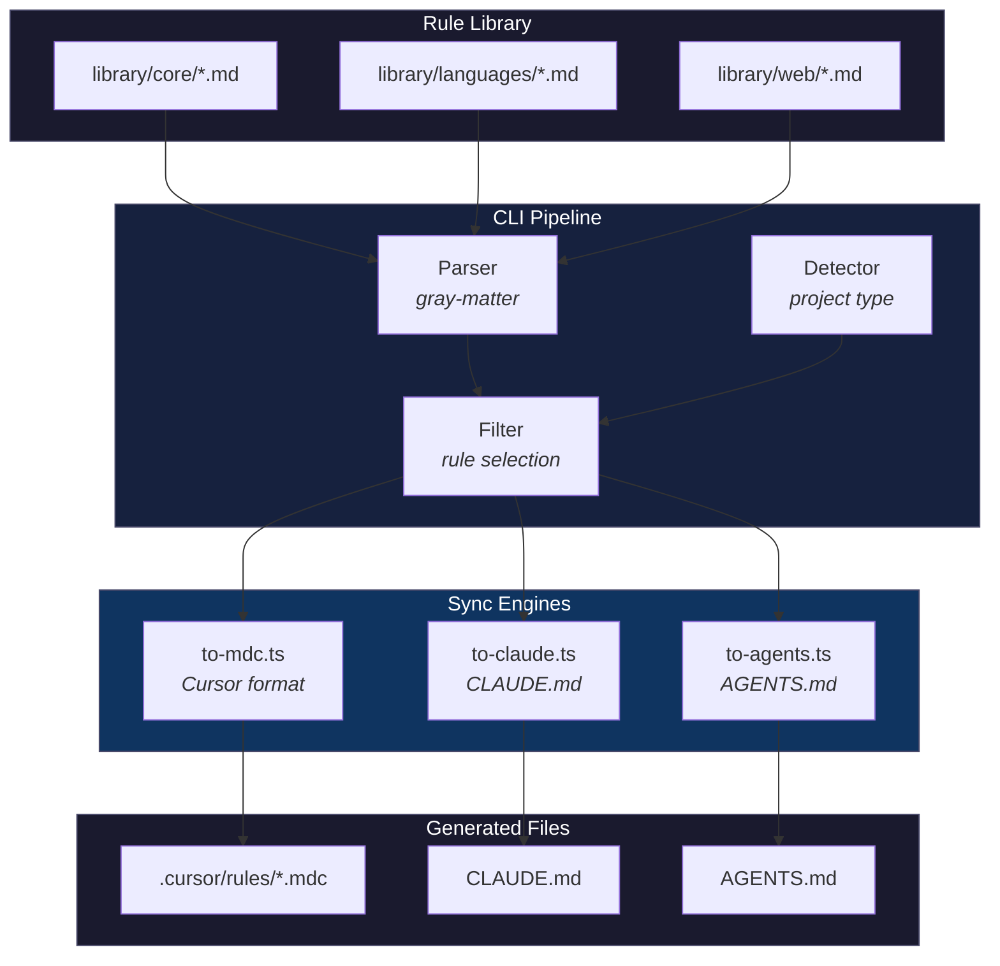
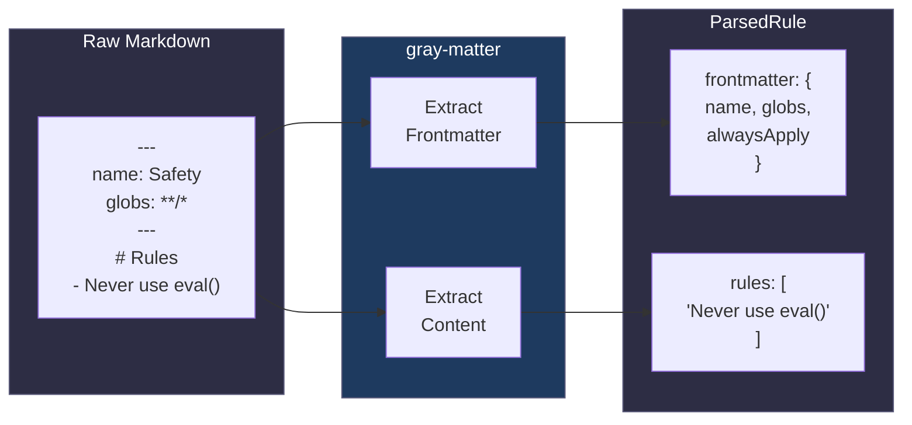
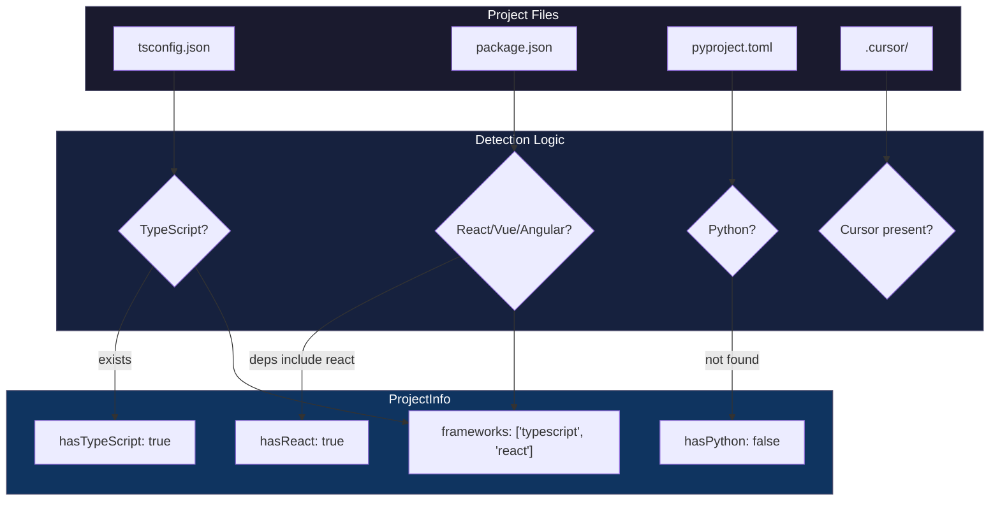
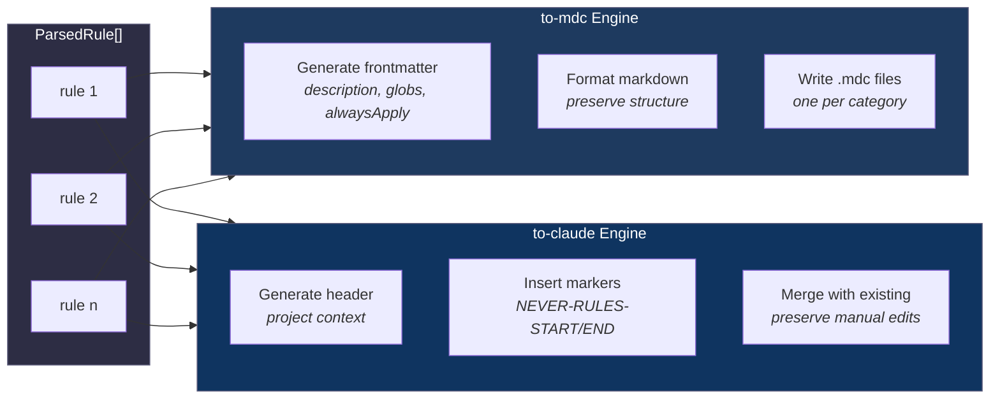
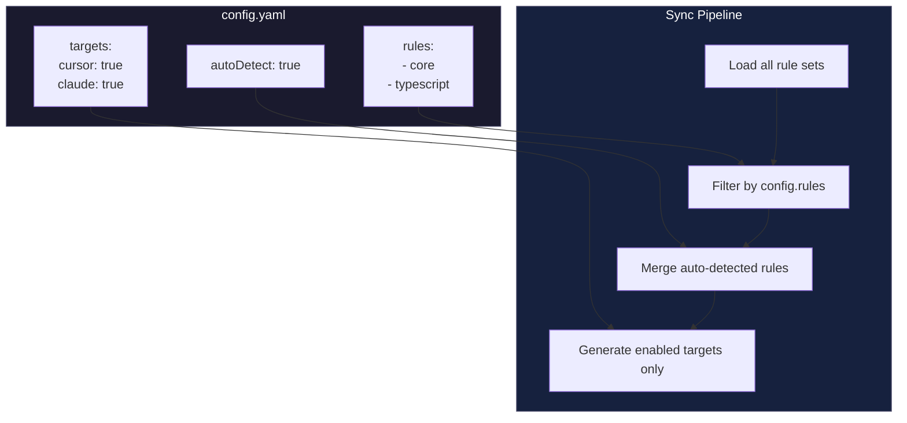
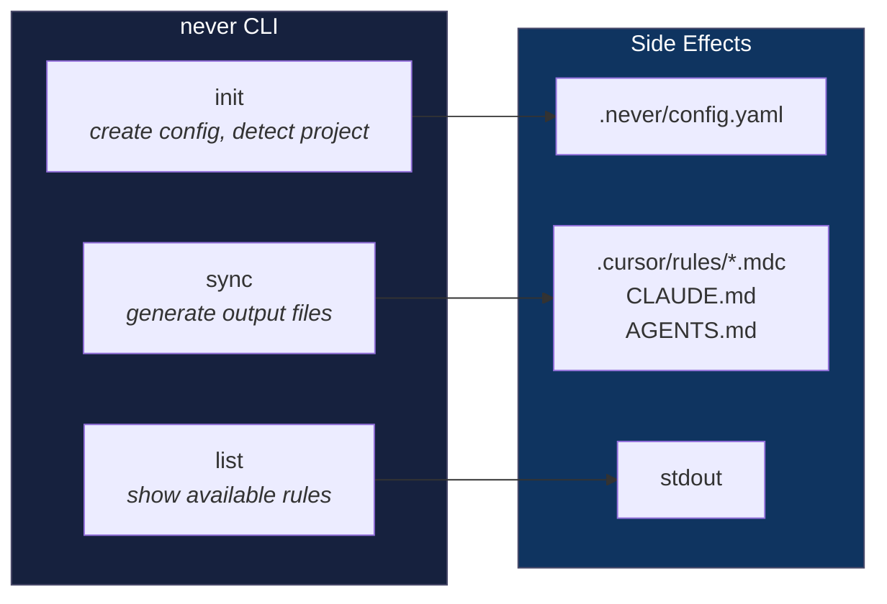

# Architecture

*"Make the change easy, then make the easy change."* — Kent Beck

Never follows a straightforward pipeline architecture. Rules flow in, formatted output flows out. There is no state to manage, no caching to invalidate, no incremental builds to debug. Each sync is a complete, predictable transformation.

## System Overview

The system has three layers: input (the rule library), processing (the CLI and engines), and output (the generated files). Data flows in one direction, from source to destination, with no cycles or backflows.

## The Parser

Every rule file follows the same structure: YAML frontmatter followed by markdown content. The parser uses `gray-matter` to separate these concerns, producing a `ParsedRule` object that downstream components can work with.

The parser also extracts individual rules from the content. It scans for lines starting with `- Never` and collects them into an array. This dual output, both the full markdown and the individual rules, gives engines flexibility in how they format the final output.

## Project Detection

The detector examines the working directory for telltale files. Each check is independent and non destructive, just filesystem reads with graceful fallbacks if files are missing or malformed.

The detection result feeds into rule selection. A TypeScript project automatically includes TypeScript rules. A React project gets React rules. The user can override in config, but sensible defaults mean most projects work without configuration.

## Sync Engine Design

Each engine receives an array of `ParsedRule` objects and produces formatted output for its target tool. The engines share no state and know nothing about each other, they are pure functions that transform data.

The Claude and AGENTS engines use marker comments to preserve manual edits. When updating an existing file, they find the markers, replace only the content between them, and leave everything else untouched. This allows teams to add project specific guidance that survives regeneration.

## Configuration Flow

The config file acts as a filter and toggle mechanism. It does not change how the system works, only what subset of rules and outputs get processed.

## Command Structure

The CLI exposes three commands that map to clear user intentions.

`init` is run once per project to bootstrap configuration. `sync` is run whenever rules need updating, typically after pulling changes or modifying config. `list` is informational, showing what is available without changing anything.

## Why This Design

The architecture optimizes for understandability over cleverness. Each component does one thing. Data flows in one direction. Side effects are confined to the edges of the system.

This makes debugging trivial. If the output is wrong, you check the parsed rules. If those are wrong, you check the source files. If parsing works but output is wrong, the problem is in the engine. There is nowhere for bugs to hide.

It also makes extension straightforward. Adding a new output format means writing a new engine, not understanding a complex state machine. Adding new rules means dropping a markdown file in the right directory. The system grows linearly with features, not exponentially.

*"Simplicity is prerequisite for reliability."* — Edsger Dijkstra
